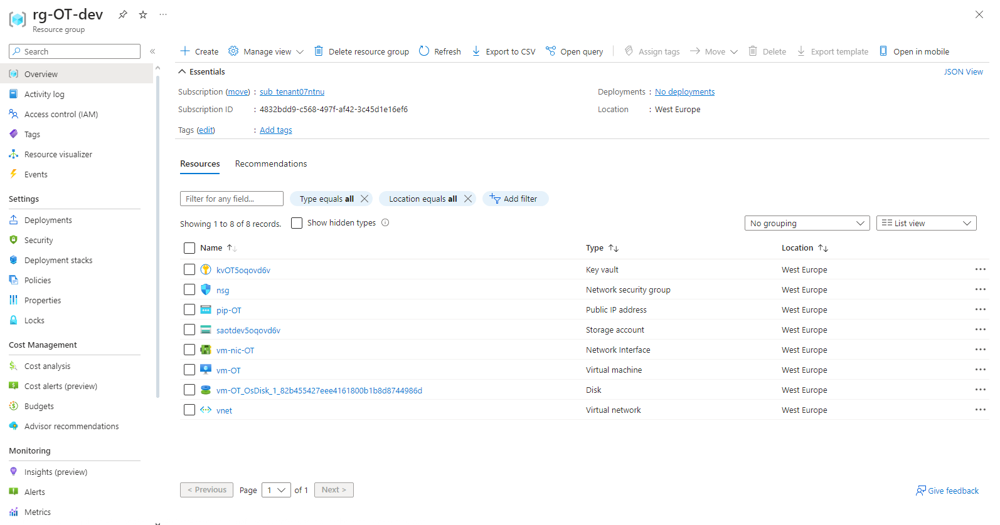
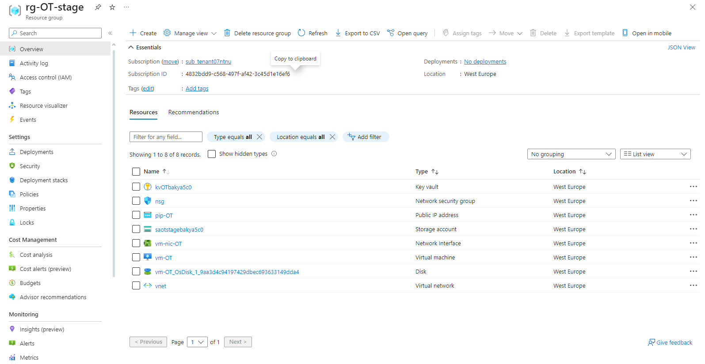
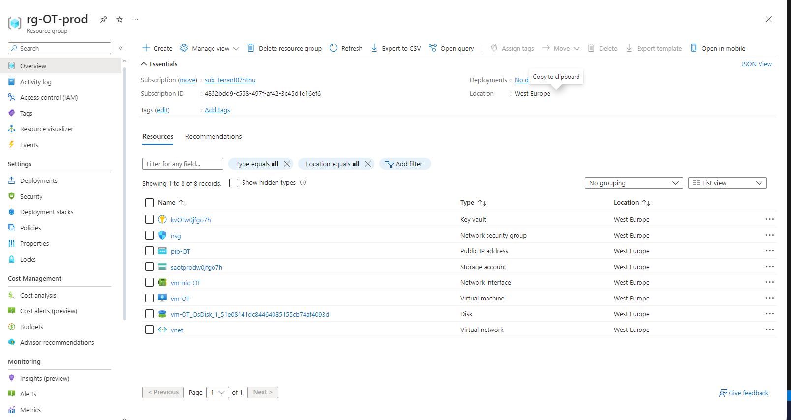

# Assignment 2 - IaC
# Pre-requisites (Windows)

In order to use the configuration files in the folder some software installations are recommended and/or necessary:

- **Visual Studio Code** (optional but very helpful): VScode is an integrated development environment that is very useful for editing configuration files. Some of its most helpful features are code completion, syntax highlighting, large selection of useful extensions.

- **Chocolatey** (optional): Chocolatey is a package manager and installer for Windows. It makes the process of downloading and installing software very simple and will be useful in the next steps.

- **Terraform** (mandatory): Terraform is an IaC tool that uses a declarative langue which makes creating, managing, and destroying resources on cloud platforms simple and intuitive.

- **Azure CLI** (mandatory): "The Azure Command-Line interface (CLI) is a cross-platform command-line tool to connect to Azure and execute administrative commands on Azure resources." (Microsoft, 2023)

-**Github repository** (mandatory to utilise the CI/CI workflow): A Github repository is necessary to store the configuration files and to use the CI/CD workflow later on.

# Infrastructure Configuration
The infrastructure configuration is done using Terraform. The configuration files are located in the folder "module07" which is a modified copy of the infrastructure from the course repository. The configuration files are:
- **The main configuration file:** This file defines the resourcce group for all the other resources in addition to defining some blocks to generate random a random string that will be used for the sotrage account and a random password generator that will be used for the virtual machine. In this file there is a locals block that makes the whole infrastructure stack dynamic. The resource group name is dependent on the workspace which means that the same configuration can be used for multiple workspaces. The workspace name will be added as a suffix for the gresource group name (except for the default workspace).

- **The providers configuration file:** This file defines the provider for the Azure cloud platform. It also defines the version of the provider that will be used. In addition, the backend for storing the tfstate file is defined in the providers file. 

- **The storage account configuration file:** This file defines a storage accoun as well as a storage containter. This file also uses a locals block to make the name dynamic depending on the workspace because the storage account name must be globally unique.

- **The key vault configuration file:** This file defines a key vault with two secrets, one for the storage account container key and one for the virtual machine password.

- **The network configuration file:** This file defines a virtual network with a subnet and a network security group. The network security group has a security rule that defines what trafic is allowed in.

- **The virtual mahcine configuration file:** This file defines a virtual machine with a public IP address, and network interface. The virtual machine is also configured to use the password generated in the main configuration file.

- **The variables file:** This file defines the variables that are used in the configuration files. The variables are given default values so that a CI/CD workflow can be utulised later.

# CI/CD Workflow configuration

The CI/CD workflow is configured using Github Actions. The configuration files are located in the folder ".github/workflows". The configuration files are:

- **The Deploy.yml file:** This file is responsible for deploying the defined infrastructure to Azure. The workflow will only trigger when a push to main happens. the file defines three jobs with multiple steps:
    - Deploy to the dev wokspace: this will perform a terraform init and terraform apply on the development workspace.

    - Deploy to the stage workspace: this job is dependent on the completion of the previous job and will perform a terraform init and terraform apply on the stage workspace.

    - Deploy to the prod workspace: This job will be executed in the production environment which means that it will need to be approved by at least one person. This job is also dependent on the completion of the previous job and will perform a terraform init and terraform apply on the production workspace.

- **The InfraValidate.yml file:** This file is responsible for validating the defined infrastructure.  The workflow will trigger when a push happens to any branch. This job will perform a terraform init and terraform validate on the infrastructure code.

- **The InfraLint.yml file:** This file is responsible for linting the defined infrastructure.  The workflow will trigger when validate workfole is completed.
# Configuration Usage

## Manual deployment

In order to use the configuration files in the folder through VScode or other software, the pre-requisites marked mandatory above have to be met.

- The first step is to open the folder in VScode and open a terminal window.

- The second step is to execute the command "terraform init" which initializes the working directory that contains the configuration files. In addition, the command will initialize the selected backend. However, some credentials must be provided beforehand including the client id, client secret, tenant id, and subscription id. One way to do this is creating environment variables using the following commands (filling the quote marks with your own credentials):

    $env:ARM\_CLIENT\_ID = ""

    $env:ARM\_CLIENT\_SECRET = ""

    $env:ARM\_TENANT\_ID = ""

    $env:ARM\_SUBSCRIPTION\_ID = ""
    
- The third step which is optional but good practice is to run the command "terraform fmt" which will format the configuration files and "terraform validate" which will check if the configuration is a valid one.

- The fourth step is to create an execution plan. This is done using the command "terraform plan" which will check for already existing remote resources and then comparing the current configuration to any existing resources. The command output will be a detailed list of the resources that are going to be created, changed, or destroyed. Optionally, which is a recommended practice, you can use the "-out=filename" option which will create a file and save the plan in it. During the planning phase you will be asked to input the values for any variables you are using in your configuration. Alternatively you can create a terraform.tfvars file and fill in the variable values there and terraform will automatically detect and take the variable values for the .tfvars file (it is important to not store this file in a repository as it might contain extremely sensitive data).

- The fifth step is to deploy the resources that you previously planed using the command "terraform apply" or "terraform apply plan\_file" if you opted for the -out option during the planning phase. This will initiate the deployment of the resources and might take few seconds to minutes depending on the resources you are deploying.

- After the resources are utilised and it is time to delete them, the command "terraform destroy" should be used for that. This command will destroy all resources managed by the current configuration. This command is just an alias for the command "terraform apply -destroy". The command will ask for confirmation before destroying the resources.

## CI/CD deployment

In order to use the CI/CD workflow, the pre-requisites marked mandatory above have to be met.

- The first step is to create a repository on Github and clone it to your local machine.

- The second step is create the necessary repository secrets to be use for authentication. and created three wokflows in the github action tab, one for deployment and two for the tests using .yaml files in the .github/workflows directory.

- The third step is to copy the configuration files fto the repository folder.

- The fourth step is to create a new branch and push the changes to the repository. This will trigger the validate workflow which will check if the configuration is valid. When the validate workflow is completed, the lint workflow will be triggered. After completion of both workflows, a pull request can be created to merge the changes to the main branch.

- The pull request will then be reviewed and approved by at least one person. After approval, the changes will be merged from the created branch into the main branch. This will trigger the deploy workflow which will deploy the infrastructure to the dev workspace. After the deployment is completed, the stage workflow will be triggered which will deploy the infrastructure to the stage workspace. After the deployment is completed, the prod workflow will be triggered which will deploy the infrastructure to the prod workspace. The prod workflow will require approval from at least one person before it can be executed.

# Infrastructure backend
The backend used in this configuration is the same one we were instructed to create in the weekly assignment during the lecture labs. the storage account for the backend contains a storage container that holds  the tfstate files. There is a file for each workspace. The backend is defined in the providers configuration file.

# Infrastructure deployment
The infrastructure is deployed to three different workspaces. The first workspace is the dev workspace which is used for development and testing. The second workspace is the stage workspace which is used for staging and testing. The third workspace is the prod workspace which is used for production. The infrastructure is deployed to the workspaces using the CI/CD workflow. The workflow is triggered when a push to the main branch happens. The workflow will then deploy the infrastructure to the dev workspace. After the deployment is completed, the stage workflow will be triggered which will deploy the infrastructure to the stage workspace. After the deployment is completed, the prod workflow will be triggered which will deploy the infrastructure to the prod workspace. The prod workflow will require approval from at least one person before it can be executed.

## The resources deployed to the dev workspace:

## The resources deployed to the stage workspace:

## The resources deployed to the prod workspace:

# Destruction of resources:
The resources are manually destroyed using the command "terraform destroy". This command will destroy all resources managed by the current configuration. This command is just an alias for the command "terraform apply -destroy". The command will ask for confirmation before destroying the resources.